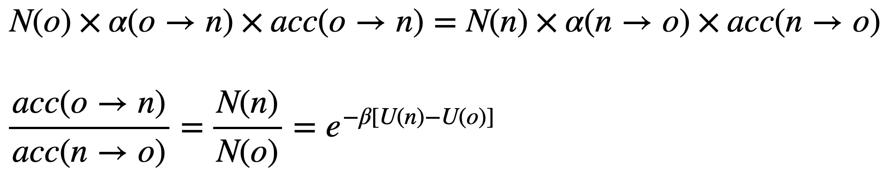
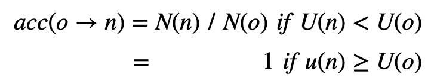
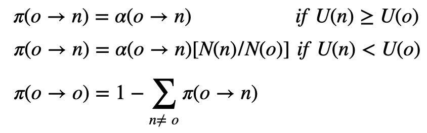

# A R1215's Guide to Monte-Carlo Simulation

 Monte Carlo [_"MON-tee KAR-loh"_], Monaco (Source : Wikipedia)

## Fundamental Statistical Mechanics
- Deterministric   : "if position($r(t_0)$) and momentum($p(t_0)$) are determined, $r(t)$ and $p(t)$ also can be determined w.r.t. any value of t"  > initial configuration ($r(t_0)$ & $p(t_0)$) are _super_ important ! 
    - $\vec{F} = m\vec{a}=\frac{d\vec{p}}{dt}$ can be used to calculate a new $r(t)$ and $p(t)$ ! 

- Phase Space
 

 (Source : Wikipedia)

- Phase crossing cannot occur ! (It's not deterministric)

- Time Average of the observable A :  $\braket{A} = \lim_{t \to \infty}\frac{1}{\tau}\int^{\tau}_{0}A(\textbf{p}^N(t)\ \textbf{r}^N(t))\ dt$
 > It's simple, but calculating $r(t)$ & $p(t)$ for evert t for N particles is __IMPOSSIBLE__.

- Ensembles
 : a collection of a very large number of systems of interest
 > Why don't we generate __LOTS LOTS LOTS__ of $r(t_0)$ and $p(t_0)$ and do something with it?
    - Types of Ensembles
        - 
         (Source : Wikipedia)
        - Microcanonical (NVE)
        - Canonical (NVT)
        - Isothermal-Isobaric (NpT)
        - Grand-Canonical ($\mu$ VT)

- Partition Function, Q
    - For Canonical Ensemble (NVT),
     $P(\textbf{r}^N\ \textbf{p}^N) = \frac{1}{Q}\ e^{-H(\textbf{r}^N\ \textbf{p}^N)/k_BT}$ (Probability)
     with $Q = \int\int d\textbf{p}^N d\textbf{r}^N e^{-H(\textbf{r}^N\ \textbf{p}^N)/k_BT}$ (Partition Function)
    - $\textbf{r}^N$ : the coordinates of all N particles
    - $\textbf{p}^N$ : the momenta of all N particles
    - $H(\textbf{r}^N\ \textbf{p}^N)$ : Hamiltonian (energy) of the system
        - $H(\textbf{r}^N\ \textbf{p}^N)$ = $K(\textbf{r}^N\ \textbf{p}^N)$ + $U(\textbf{r}^N\ \textbf{p}^N)$
        - $K$ : the kinetic energy of the system -> $\textbf{p}^N$
        - $U$ : the potential energy of the system -> $\textbf{r}^N$

- Ensemble Average of the observable A :  $\braket{A} = \frac{\int\int d\textbf{p}^N d\textbf{r}^N A(\textbf{p}^N,\ \textbf{r}^N)\ e^{-\beta H(\textbf{r}^N\ \textbf{p}^N)}}{\int\int d\textbf{p}^N d\textbf{r}^Ne^{-\beta H(\textbf{r}^N\ \textbf{p}^N)}}$, with $\beta = \frac{1}{k_BT}$

- 
 (Source : Wikipedia)

- Ergodic "Postulate" : "Time Average" == "Ensemble Average"
 > We use this postulate for systems in equilibrium state.

## The Monte-Carlo Method
- Ensemble Average of the observable A :  $\braket{A} = \frac{\int\int d\textbf{p}^N d\textbf{r}^N A(\textbf{p}^N,\ \textbf{r}^N)\ e^{-\beta H(\textbf{r}^N\ \textbf{p}^N)}}{\int\int d\textbf{p}^N d\textbf{r}^Ne^{-\beta H(\textbf{r}^N\ \textbf{p}^N)}}$, with $\beta = \frac{1}{k_BT}$
    - $A(\textbf{p}^N)$ can be carried out analytically since it's quadratic.
    - What about $A(\textbf{r}^N)$ ?
        - $\braket{A} = \frac{1}{Q} \int d\textbf{r}^N\ A(\textbf{r}^N)\ e^{-\beta U(\textbf{r}^N)}$ (expectation value, momenta are ignored)
        - Do we really have to search for $\int d\textbf{r}^N A(\textbf{r}^N)\ e^{-\beta U(\textbf{r}^N)}$ ?
        - So many integrations!!
        - Since Boltzmann Factor decays quickly, it's mostly zero.

- Monte Carlo Method
    - In the case we don't know probability $p(x)$,   we can estimate expectation value using $\braket{A} = E[A(x)] = \frac{1}{N}\sum^{N}_{i=1}\ A(x)p(x)$
    - Central Limit Theorem (__CLT__)
        - Sampling itself has a form of Gaussian Distribution
        - 

- Importance Sampling
    - 
    - We sample many points in the region where the Boltzmann factor is large and few elsewhere.  (Uniniformly distrubuted sampling points)
    - Here's how
     [Importance Sampling](https://www.youtube.com/watch?v=C3p2wI4RAi8)
     (Thanks, YouTube !)

## The Metropolis Method

- In the video above, we've seen that choose of $q(x)$ is highly important, and decides the successfulness of importance sampling.

- We need to construct a $q(x)$ that is proportional to the Boltzmann factor.  > Then we need $Q$ ! (partition function)  >
It's still __USELESS__ ! (We cannot annalytically calculate Q)

- However,
    - $\braket{A} = \frac{\int d\textbf{r}^N\ A(\textbf{r}^N)\ e^{-\beta U(\textbf{r}^N)}}{\int d\textbf{r}^N\ e^{-\beta U(\textbf{r}^N)}}$

    - We wish to know only the _ratio_ of two integrals !

    - Let's use Markov Chain, depending on the idea of "acceptance & denial", so that we can examine the ratio of possibility without considering prori distribution. 

## Let's say something about the technical part...

- How do we generate the points with a relative probability proportional to the Boltzmann factor ? (Equilibrium)

    - Prepare a initial configuration denoted by $o$ (old)

    - Generate a new trial configuration $n$ by adding a small random displacement $\Delta$.

    - Decide whether this new configuration is acceptable or not.

- Detailed balance condition
    - $\frac{\partial N(o)}{\partial t} = - \sum_{o \ne n} [N(o)\pi(o \to n) - N(n)\pi(n \to o)] = 0$ at equilibrium state.
    - So, $N(o)\pi(o\to n) = N(n)\pi(n \to o)$
    - $N(o)$ : probability of a system being at $o$
    - $\pi(o \to n)$ : probability of a system moving from $o$ to $n$
        - $\pi(o \to n) = \alpha(o \to n) \times acc(o \to n)$
        - $\alpha(o \to n)$ : probability of perfoming a trial move
          (On our example, $\alpha(o \to n) = \alpha(n \to o)$)
        - $acc(o \to n)$ : probability of accepting a trial move
    - Then, the detailed balance condition would be 
    <!---
    $N(o) \times \alpha(o \to n) \times acc(o \to n) = N(n) \times \alpha(n \to o) \times acc (n \to o)$
     
    $\frac{acc(o \to n)}{acc(n \to o)} = \frac{N(n)}{N(o)} = e^{-\beta [U(n) - U(o)]}$
    --->

- So that in Metropolis Algorithm,
    - 
    <!--- 
    - $acc(o \to n) = N(n)\ /\ N(o)$ if $U(n) < U(o)$
    - $acc(o \to n)$ = 1 if $U(n) \ge U(o)$
    --->
    - Which leads to 
    <!---
    $\pi(o \to n) = \alpha(o \to n)$ if $N(n) \ge N(o)$ 
     
    $\pi(o \to n) = \alpha(o \to n)[N(n)/N(o)]$ if $N(n) \lt N(o)$
     
    $\pi(o \to o) = 1 - \sum_{n \ne\ o} \pi(o \to n)$ 
    --->

- Our Goal is
    1. Choose a random spin $S_i$
    2. Compute the energy change $\Delta E$ associated to the flip $S_i \to -S_i$
    3. Generate a random number $0 \le \xi \le 1$ with a uniform distribution
    4. If $\xi \lt e^{-\beta\Delta E}$ then flip the spin (accept), if not, leave it in its previous state (deny)
    5. Repeat.
